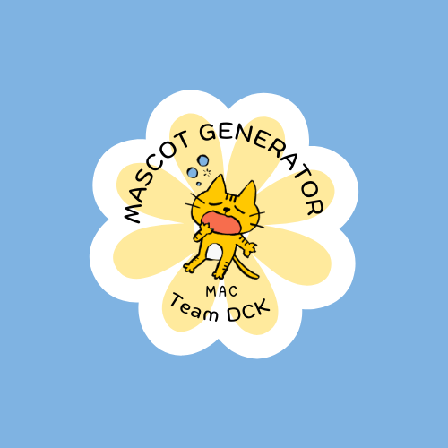
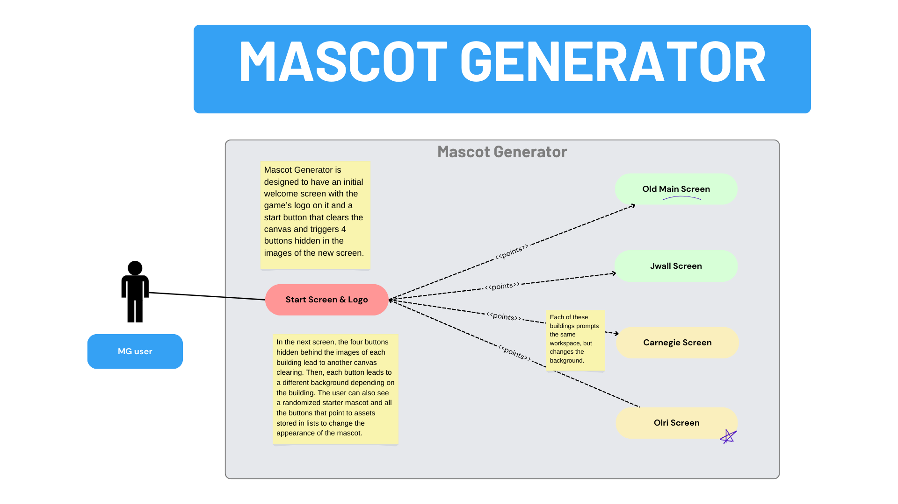
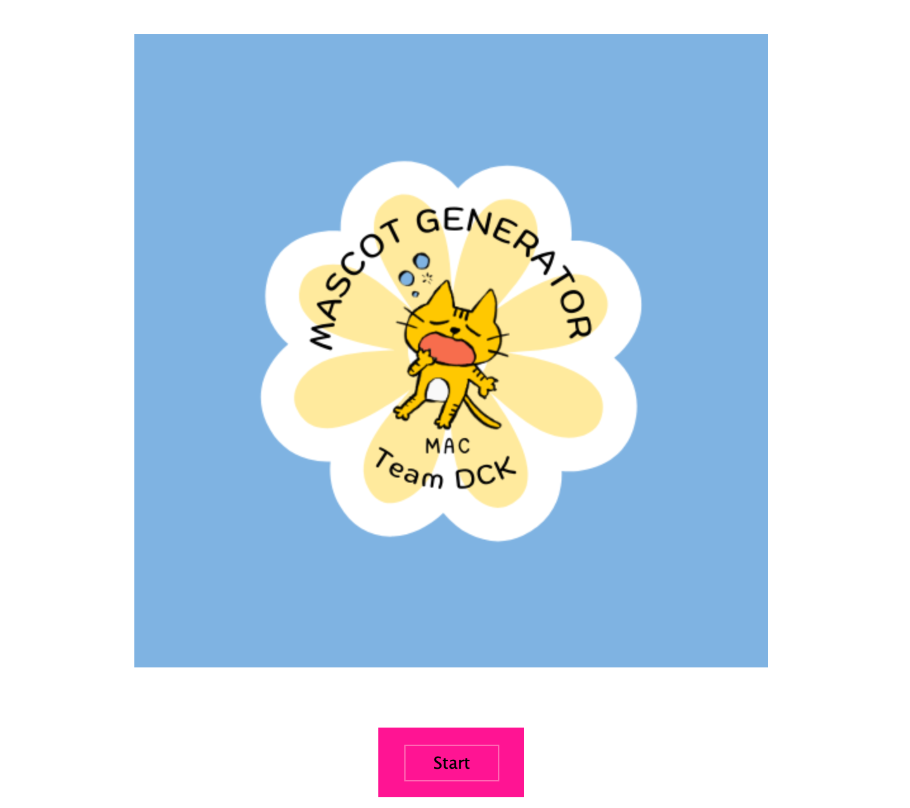
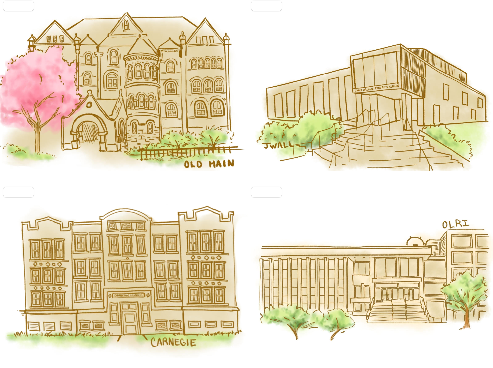
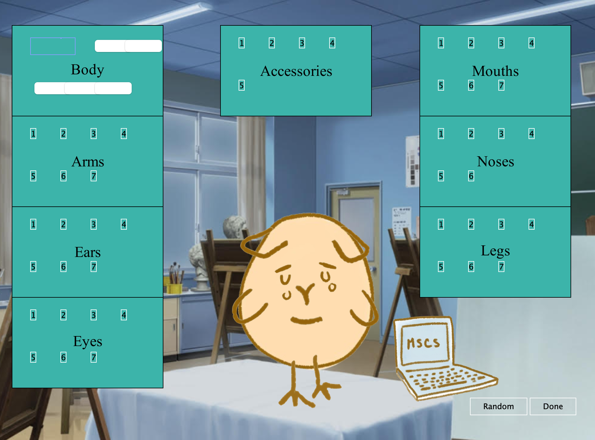
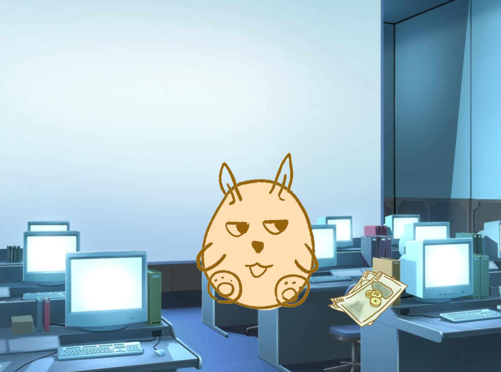

# Department Mascot Customizer

Team: 
-
DCK

Dani Arana, Clarissa Sigale, Karla Martinez

Overall Description:
-
  

  The Mascot Generator game is designed to allow users to create a mascot based off the Macalester building and area of study they have the most interest in. The user may choose one of the four buildings, OLRI, Carnegie, Old Main, and JWall, in order to produce a specific background that relates to the majors that take place in said building. Afterwards the user will be given a blank canvas of a mascot to customize to their liking, while the main body will remain the same, an egg shape, the user will be able to pick its ears, eyes, feet, accessories, etc. Once the user is satisfied with their mascot they'll press submit and have a brand new mascot for the building/departments of their choice.

Context:
-
  Macalester College is a private institution that was founded in 1874. Macalester students come from every state in the U.S. and 94 countries to attend academic programs ranked among the top in the nation. The college's philosophy of global citizenship and collaborative learning prepares students with diverse backgrounds. It is due to its varied range of experiences in the student body, that Macalester focuses on having an accessible curriculum that allows students to explore different areas of study. THe most popular majors at Macalester College include Multi/Interdisciplinary Studies, Visual and Performing Arts, Physical Sciences, Psychology, Mathematics, and Economics. As a very accepting, open-minded, and active college, it offers many opportunities to engage with the Twin Cities community, study abroad, and learn about different cultures. 

Inspiration/Mission:
-
The combined experience of dress up games as kids, the fun and creativity that was afforded to us as children by being able to design such characters. As Macalester students, creating an interactive user-friendly game that allows users to bring their past experiences with these types of games together with their experience as they transition into college was very important. 

Overview
-
The following diagram shows how Mascot Generator works: 

1. The user opens the game and is greeted with the game logo and a start button that will take them to another screen. The canvas clears when the user clicks on the start button. This is done by an on-click event lambda. 

2. The user then is able to see a screen with four images. The four images represent the four main academic buildings at Macalester College. Clicking on any of them will clear the screen again and trigger an event that shows the user a different screen. 

3. The new screen built by this event contains more graphics elements that are triggered by different buttons. 

Each of the assets that can be switched at will on the mascot are numbered and have a button that triggers their set position on the canvas. These are called from a list that accesses the folder they are stored in. 
4. The randomizing button in the lower left corner uses a random object to gather elements from each list of assets to change the mascot at random. The "Done" button next to it removes all buttons, only leaving the mascot and the background on the screen. 

UML CLASS DIAGRAM:
-
https://cdn.discordapp.com/attachments/1228382473168093237/1228383332102836304/UML_Project.jpg?ex=662bd820&is=66196320&hm=8171792b0b6d41dd5e093aaacb35b647dbf447d4ea01153bcfbfcf474ebc981a&

